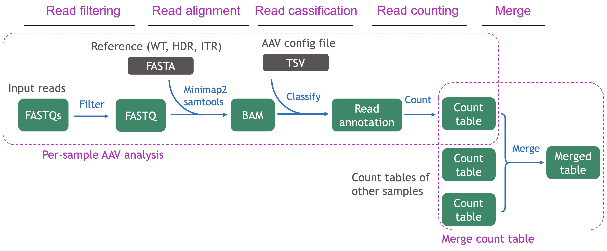
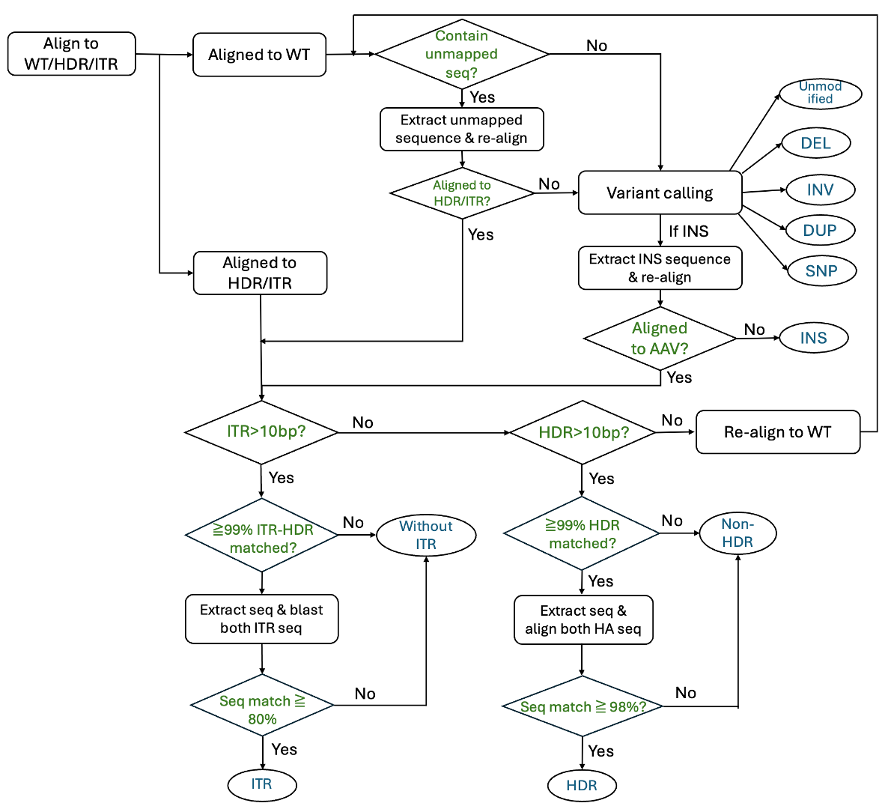
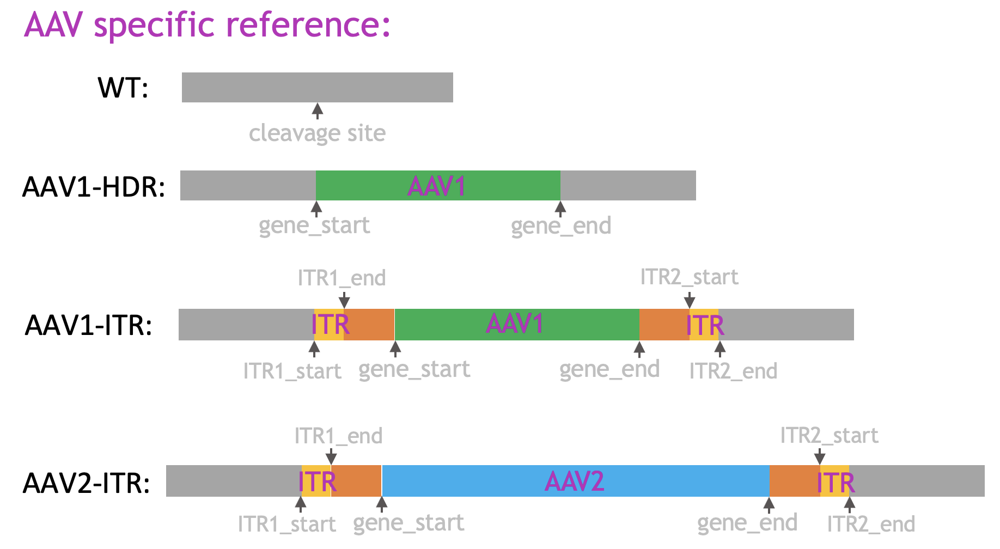

<!-- confluence-page-id: 490111950 -->
<!-- confluence-space-key: KSR -->
<!-- generated-by: Do not edit. This page was auto-generated from the pipeline repo. -->

# ALPINE: AAV integration evaluation using targeted long-read sequencing data

This repo represents ALPINE  pipeline for AAV integration evaluation using targeted long-read
sequencing data. It contains Docker files, CWL workflows, multi-platform launcher code, and other scripts used for
on-target AAV integration evaluation.

## Table of Contents

- [Overview](#overview)
- [Steps](#steps)
  - [Per-sample AAV analysis](#per-sample-aav-analysis)
    - [Read filtering](#read-filtering)
    - [Read alignment](#read-alignment)
    - [Read classification](#read-classification)
    - [Read counting](#read-counting)
  - [Merge classification table](#merge-classification-table)
- [Inputs](#inputs)
  - [Sequencing FASTQ](#sequencing-fastq)
  - [Reference sequences](#reference-sequences)
  - [AAV vector config](#aav-vector-config)
  - [Primer sequences](#primer-sequences)
  - [Sample name](#sample-name)
  - [Optional inputs](#optional-inputs)
  - [Inputs for merge classification table step](#inputs-for-merge-classification-table-step)
- [Outputs](#outputs)
  - [Per-sample outputs](#per-sample-outputs)
    - [Filtered FASTQ](#filtered-fastq)
    - [Sorted BAM](#sorted-bam)
    - [Read annotation](#read-annotation)
    - [Single-sample classification table](#single-sample-classification-table)
  - [Merged classification table](#merged-classification-table)
- [How to run pipeline](#how-to-run-pipeline)
- [Update workflows in SBG and Arvados](#update-workflows-in-sbg-and-arvados)
- [Contacts](#contacts)

## Overview

This pipeline evaluates on-target AAV integration efficiency by analyzing targeted long-read sequencing data.  

## Steps



The AAV analusis pipeline main includes two steps, per-sample AAV analysis step and merge count table step. Per-sample
AAV analysis workflow is run on all samples individually to classify reads into 10 categories and count reads in each
category. After all samples are processed through per-sample workflow, merge count table step merges results from all
samples together into a merged table.

### Per-sample AAV analysis

Per-sample AAV analysis step includes four parts: Read filtering, Read alignment, Read classification, and Read
counting.  
Input files of per-sample AAV analysis include sequencing reads (FASTQ), reference sequences (FASTA), vector config file
(TSV); and outputs include filtered sequencing reads (FASTQ), alignment file (BAM), read clssification results (TXT),
and read count table (TXT).

#### Read filtering

Input reads are first filtered to ensure only complete and high-quality sequencing reads are used for later analysis.  
Filtering criteria include:  

__a. Read completeness.__
Complete sequencing reads are expected to include PCR primer sequences on both ends when PCR amplification is performed
for targeted sequencing. Sequencing reads without primer sequences on either end are filtered out due to truncation.  
Considering high sequencing error rate of long-read data, a 10-bp sliding window is used to check presence/absense of
primer sequence. The primer sequence is considered as present if any sequential 10 bases of the primer is presentin the
first/last 100 bp of the sequencing read.  
(e.g., for a 25-bp forward primer sequence, 16 sub-sequences of 10bp (sub-sequence from base 1-10, 2-11, 3-12, ..., and
16-25) will be used to check if the subsequence is present in first 100-bp of the sequencing read. If any one of these
16 subsequence is present, then this sequencing read is considered to include forward primer at beginning.)  
Reverse compelemntary sequences of primer sequneces will also be checked in case read is from anti-sense thread.
Sequencing reads containing only 1 side of primer sequence or neither side will be filtered out.  
If only forward or only reverse primer sequence is provided, then read filtering step will only check primer for one
side and skip the other side. If no primer sequence is provided (i.e. when no PCR is conducted, or user wants to disable
PCR primer-based filtering), read filtering step will skip checking for presence of PCR primers and all sequencing reads
will pass this filter.
  
__b. Base quality.__
Average base quality of a sequencing read is calculated based on the Phred quality score for all bases from the input
FATSQ file. Sequencing reads with average base quality below input "Minimal average base quality" (default value of 30)
are filtered out due to low quality.

#### Read alignment

Filtered sequencing reads are then aligned to the reference sequences using minimap2. By default, a preset of alignment
settings ("-x map-hifi") is used for aligning PacBio HiFi data.  
Read alignment file is then sorted and indexed using Samtools.

#### Read classification



Read alignment results are used to classify reads into 10 categories. Overall, reads aligned to HDR/ITR sequences will
be classified based on the length of ITR and HDR sequences in the alignment; and reads aligned to WT will go through
variant calling process to be assigned as Unmodified or into a variant category. To achieve most accurate read
classification results, some additional processes were implanted, including re-aligning unmapped sequence, re-aligning
INS sequence, and re-aligning extra-short HDR reads to WT.

Major processes of read classification includes:  
__a. Process alignments on HDR/ITR sequences.__ For reads aligned to ITR sequences, if the alignment includes at
least 10bp on ITR sequences either on left or right side, this read will be assigned as ITR-integration or Non-HDR-with-ITR
(Truncated ITR-integration) depending on if the ITR integration length is above the input "Truncated HDR/ITR Threshold"
percentage (default is 95%) of expected full-length ITR-integration length. If the alignment includes less than 10bp of ITR
sequences on both side, it will be treated as aligned to HDR sequences as described in next paragraph.  
For reads aligned to HDR sequences, if it includes at least 10bp of transgene/HDR sequence, this read will be
assigned as HDR/Non-HDR-without-ITR depending on of integration length (cutoff is the same with ITR/Truncated-ITR cutoff).  
If the read alignment contains less than 10bp of HDR sequence, it will be re-aligned against only the WT sequence from
input reference and then re-processed as a read aligned to WT as described below in #c.  
  
__b. Process alignments on WT sequence.__ For reads aligned to wildtype (WT) seqeunce, if there are >100bp unaligned
sequences on either end of the alignment, the unaligned sequences will be extracted and re-align as descripbed in #d.
Variant calling is performed on the read alignments to detect SNPs, indels (large and small), inversions, and
duplications within 20bp window on both sides of the cleavage site.  
If there is no variants reported, the read will be assigned as Unmodified.  
If only one type of variant is reported (e.g. only a 10bp DEL is reported for ReadA, two SNPs are reported for ReadB),
the read will be assigned to the corresponding variant category (e.g. ReadA -> DEL-small, ReadB -> SNP).  
If more than one type of variants are reported, the largest variant will be used to classify read category (e.g. ReadC
has a 90bp INS, two SNPs, and a 40bp DEL, ReadC -> INS).  
If a read carries insertion longer than 50bp, the insertion sequence will be extracted and realigned against HDR/ITR
sequences as described in #e.  
  
__c. Re-aligning extra-short HDR reads to WT.__ When a read is aligned to HDR/ITR sequences but the integrated HDR/ITR
sequence is shorter than 10bp, it will be too short to be assigned as Non-HDR-without-ITR, and the entire read will be
re-aligned against WT sequence to detect variants. The alignment against WT will then be processed as "aligned to WT"
as described in #b.  
  
__d. Re-aligning unmapped sequence.__ For reads aligned to WT with >100bp unmapped sequence (present as soft or hard
clip) on either end of the alignment, we first check all other supplementary alignments of the same read to make sure
these unmapped sequence are not mapped to any reference sequences. A new reference sequence file containing only HDR
and ITR sequences from original input reference is created and used to re-align these unmapped sequecnes using
"minimap2 -x map-hifi".  
If the unmapped sequence can be aligned to HDR/ITR, the new alignment result will then be processed as "aligned to
HDR/ITR" as described in #a.  
If the unmapped sequence still cannot be aligned to HDR/ITR, the read will be processed as "aligned to WT" as described
in #b.  
  
__e. Re-aligning INS sequence.__ If a large (>50bp) insertion is reported for a read, re-aligning is performed to check
if inserted sequence is actually coming from AAV vector.
For reads containing large INS, the inserted sequence is extarced (e.g. a 1500bp INS is reported for ReadD, this 1500bp
sequence will be extracted, not the entire read) and re-aligned to the original input reference file.  
If the inserted sequence is aligned to HDR/ITR sequence, this new alignment result will then be processed as "aligned
to HDR/ITR" as described in #a.
Otherwise, this read will be classified as INS-large.  

#### Read counting

Read counting step takes read classification result table (readname_$(SAMPLE_NAME).txt) as input and counts number of
reads in each read category.
A customized Python script is used to read the input table, count occurance of each read category in second column, and
write a tab-delimited text file to list number of reads in each category.

### Merge classification table

Merge classification table merges the individual read count tables into a single table. A customized Python script is
used to read in all input read count tables, merge the tables according to column name, and write a tab-delimited text
file as output.  
If different vector config files are used in per-sample step (i.e. SampleA has AAV1 and SampleB has AAV2), merged table
will have more columns than individual count table to include extra columns for HDR/ITR of other AAVs. In this case, 0
will be assigned to these new columns for samples without this AAV (i.e. SampleA will have 0 reads for HDR-AAV2,
Non-HDR-with-ITR-AAV2, and Non-HDR-without-ITR-AAV2; same for SampleB in AAV1-related columns).

## Inputs

Inputs of the per-sample analysis workflow include five required inputs and optional inputs. Inputs of merge step
includes a list of read annotation results from per-sample step for all samples.

### Sequencing FASTQ

Long-read sequencing data of the sample. File can be in FASTQ or zipped FASTQ.GZ format. Currently only 1 FASTQ/FASTQ.GZ
file is allowed as input. If there are multiple FASTQ files for one sample, merge them into one FASTQ file before
running this pipeline.

### Reference sequences

A reference sequence file used for read alignment and read classification. There are three types of reference sequences:
WT, HDR and ITR, representing differen outcomes of AAV integration:



- WT - Wildtype sequence covering the cleavage site. Sequence is usually identical with the human reference genome such
as GRCh38 or GRCh37.
- HDR - HDR knock in of AAV vector, containing trans gene sequence from AAV between the cleavage site.
- ITR - ITR integration of AAV vector. Containing ITR seuqnece and HA sequence on both side of the trans gene sequence.

This reference file should contain at least wildtype (WT) sequence and ITR sequence for each AAV vector. It is good to
include HDR sequence as well.  
  
An example reference sequence FASTA file containing sequences shown in above plot is like:

> \>ref_WT  
> ATCGATCG...  
> \>ref_HDR_AAV1  
> ATCGATCG...  
> \>ref_ITR_AAV1  
> ATCGATCG...  
> \>ref_ITR_AAV2  
> ATCGATCG...

### AAV vector config

A config file to list detailed information about AAV vectors. A header line must be present, and then each row
represents one sequence in the reference sequence file. 9 columns are required for the config file:

- AAV_Vector - AAV vector name.
- Ref_Name - Reference sequence name (should be identical with the sequence name from reference FASTA file).
- Ref_Type - Type of reference sequence. Choice from HDR, WT, ITR.
- ITR1_start - Starting position of first ITR element on left side.
- ITR1_end - Ending position of first ITR element on left side.
- gene_start - Starting position of trans gene.
- gene_end - Ending position of trans gene.
- ITR2_start - Ending position of second ITR element on right side.
- ITR2_end - Starting position of second ITR element on right side.

Hints:

- All positions in the config file should be 1-based.
- Use NA if any column is not applicable, i.e., use NA for ITR start/end for HDR.
- For WT sequence, use any existing AAV vector name in the AAV_Vector column (e.g. use AAV1 for WT sequence in the
example below). Do not use a new name (such as WT or NA), which will mislead the program to consider it as a new AAV
vector.
- Order of columns must follow the order as listed above (see example below). Order of rows does not matter.
  
An example vector file matched with previous referecne sequence file is like:

\#AAV_Vector | Ref_Name | Ref_Type | ITR1_start | ITR1_end | gene_start | gene_end | ITR2_start | ITR2_end
:-|:-|:-|:-|:-|:-|:-|:-|:-
AAV1 | ref_WT | WT | NA | NA | 1000 | 1001 | NA | NA
AAV1 | ref_HDR_AAV1 | HDR | NA | NA | 1000 | 2000 | NA | NA
AAV1 | ref_ITR_AAV1 | ITR | 1000 | 1100 | 1300 | 2300 | 2500 | 2600
AAV2 | ref_ITR_AAV2 | ITR | 1000 | 1100 | 1300 | 3000 | 3200 | 3300

### Primer sequences

Primer sequence of the forward and reverse primers used in read filtering step. Both primer sequences should be in
5'->3' direction.  
If no primer sequence is provided as input, the filter step will not filter read based on presence of primers, and only
discards reads with low quality.

### Sample name

A string of Sample Name is used as prefix to name output files. Do not include space or special characters in the name.

### Optional inputs

- Minimal average base quality - Cutoff used in read filtering step. Sequencing reads with average Phred base quality
below this cutoff will be filtered out. Default value is 30.
- Truncated HDR/ITR Threshold - Truncated HDR/ITR threshold. Input value should be a percentage between 0-1. Reads
containing HDR/ITR integration with length shorter than this percentage of full length integration will be classificed
as Non-HDR with/without ITR (see more details in Steps - Read classification section). Default value is 0.95.

### Inputs for merge classification table step

Inputs for merge classification table step are the single-sample read classification files for all samples.

- Read classification file - read classification output file from the per-sample workflow. Default file names are like
"$(SAMPLE_NAME)_read_classification.txt". Select this output file for all samples in the study so that a merged table
containing all samples will be generated for easier comparison and plot generation.

## Outputs

### Per-sample outputs

#### Filtered FASTQ

Filtered FASTQ files are named as "$(SAMPLE_NAME).fastq.gz" by default. This is the output file from the read filtering
step, and it contains sequencing reads with primer sequences on both ends and with average base quality higher than a
threshold.

#### Sorted BAM

Sorted BAM files are named as "$(SAMPLE_NAME).bam" by default. This is the output file from sort alignment step. The
BAM file contains read alignments against input reference file, and is sorted based on coordinates and indexed. It
could be used for visualization using IGV or to check individual read alignments.

#### Read annotation

Read annotation files are named as "readname_$(SAMPLE_NAME).txt" by default. This is an intemediate output file from
read classification step.  
There is no header line for this file. It contains three columns:

- Read name - Name of the read.
- Read category - The category a read is classified into. See details in Steps - Read classification section.
- Size - This is the size of the variant or the integration length of HDR/ITR. No value is provided for Unmodified
category.  

An example is like:

sequence_read_1 | DEL-small | 5
:-|:-|:-
__sequence_read_2__ | __HDR-AAV1__ | __1000__
__sequence_read_3__ | __Non-HDR-without-ITR-AAV2__ | __1200__
  
There are 10 read categories:

- Unmodified - No modifications introduced within 20bp on both side of cleavage site.
- DEL-large - Contains deletion (>=50bp) spanning cleavage site or within 20bp on both side of cleavage site.
- DEL-small - Contains deletion (<50bp) spanning cleavage site or within 20bp on both side of cleavage site.
- INS-large - Contains insertion (>=50bp) within 20bp on both side of cleavage site.
- INS-small - Contains insertion (<50bp) within 20bp on both side of cleavage site.
- SNP - Contains SNP or MNP (Multiple nucleotide polymorphism) within 20bp on both side of cleavage site.
- INV - Contains inversion spanning cleavage site or within 20bp on both side of cleavage site.
- DUP - Contains duplication spanning cleavage site or within 20bp on both side of cleavage site.
- HDR - AAV integration by HDR (Homology-Directed Repair).
- Non-HDR with ITR - Full or trunctaed AAV integration with ITR sequences. At least 10bp of ITR sequence is integrated on either side.
- Non-HDR without ITR - Non-HDR integration without ITR sequences.
- Unclassified - Reads that don't fit any other categories, including reads not mapped to HDR/ITR sequences or cleavage site.

#### Single-sample classification table

Single-sample classification table files are named as "$(SAMPLE_NAME)_read_classification.txt" by default. This table
includes number of reads classified into each category.

An example table is like:

\#Sample | DEL-large | DEL-small | INS-large | INS-small | SNP | INV | DUP | Unmodified | HDR-AAV1 | Non-HDR-with-ITR-AAV1 | Non-HDR-without-ITR-AAV1 | HDR-AAV2 | Non-HDR-with-ITR-AAV2 |  Non-HDR-without-ITR-AAV2 
:-|:-|:-|:-|:-|:-|:-|:-|:-|:-|:-|:-|:-|:-|:-
SampleA | 10 | 1 | 0 | 2 | 3 | 7 | 5 | 7 | 1000 | 10 | 7  | 0 | 0 | 1 

### Merged classification table

Merged classification table file is the merged table of single-sample classification tables. It contains the number of
reads in each class for all samples.
  
An example table is like:

|Sample|DEL-large|DEL-small|INS-large|INS-small|SNP|INV|DUP|Unmodified|HDR-AAV1|Non-HDR-with-ITR-AAV1|Non-HDR-without-ITR-AAV1|HDR-AAV2|Non-HDR-with-ITR-AAV2|Non-HDR-without-ITR-AAV2|
|-|-|-|-|-|-|-|-|-|-|-|-|-|-|-|
SampleA|10|1|0|2|3|7|5|7|1000|10|8|0|0|1
SampleB|2|4|3|1|5|8|4|1|0|0|1000|20|10|6

## How to run pipeline

### On SevenBridges

After creating a project on SBG, go to the Apps page of the reference project
and copy workflow "Transgene Integration Long-Read Launcher" into your working project.
Provide sample sheet and other inputs to run launcher app. Launcher will run per-sample workflow for each sample,
and run merge step to generate  merged read classification table.

### On Arvados

After creating a project on SBG, go to reference project and run "Transgene Integration Long-Read Launcher" workflow.
Specify the working project as the project where workflow will run and provide sample sheet
and other inputs. Launcher will run per-sample workflow for each sample, and run merge step to generate
merged read classification table.

## Update workflows in SBG and Arvados

__(For Admin only)__ Makefile is used in this repo to simplify workflow/launcher updates on SBG and Arvados after
modifications have been made to CWL/Docker files.
To push updated workflows:

```sh
# Clone the latest repo
git clone https://github.com/Maggi-Chen/ALPINE
cd ALPINE
# Push updated workflows to SBG
make sevenbridges-push-workflow
# Push updated workflows to Arvados
make arvados-push-workflows
```

To push updated launcher code:

```sh
# Push updated launcher to SBG
make sevenbridges-push-launcher
# Push updated launcher to Arvados
make arvados-push-launcher
```

## Contacts

For questions about this pipeline, please contact:

- [Maggie Chen](mailto:maggiustc@gmail.com?subect=%5BPangenome%20Pipeline%20Question%5D)
- [Xing Huang Gao](mailto:xinghuang.gao@bms.com?subect=%5BPangenome%20Pipeline%20Question%5D)
